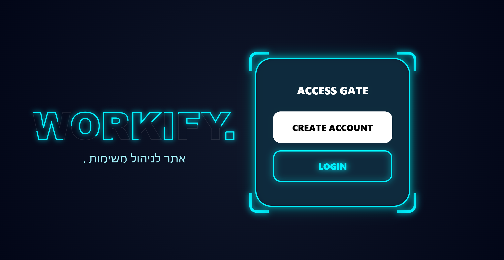
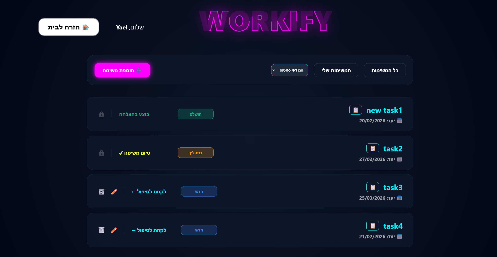
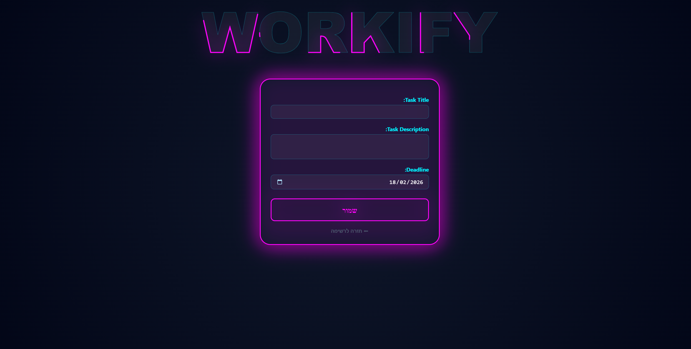
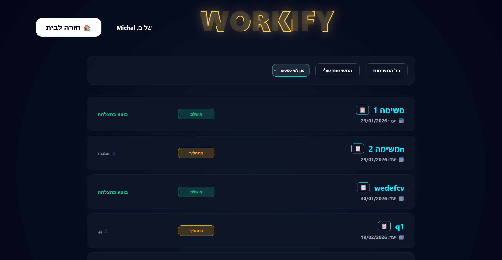

#    Task Management System


## Overview

A comprehensive task management platform designed to streamline team collaboration and provide efficient project tracking. The system features a modern, high-contrast "Dark Neon" style user interface built with Tailwind CSS, ensuring a focused and efficient user experience.

The application implements strict Role-Based Access Control (RBAC), differentiating between system administrators and regular users to maintain data integrity and business logic.

## Key Features

### Interface and User Experience
* **Modern Design:** Custom Dark Mode interface that uses neon color accents to create a clear visual hierarchy.
* **Responsive:** Fully optimized display for computer screens and mobile devices.
* **Interactive Elements:** Dynamic filtering and status updates without the need for unnecessary page refreshes.

### Permissions and Roles
The system enforces a clear separation of roles:

1. **Admin:**
* Ability to create new tasks and assign them to teams.
* Global view of all tasks in the system.
* Permission to edit or delete tasks (limited to tasks that have not yet been assigned to an employee, to prevent disruption to the workflow).

2. **Team member (User):**
* View tasks assigned to their specific team.
* "Claim" functionality for new tasks.
* Status management (marking tasks as "in process" or "completed").
* Custom filtering ("My tasks" view).

### Technical functionality
* **Dynamic filtering:** Server-side filtering by task status and assignment to a user.
* **Data validation:** Logic to prevent past date selection and ensure the validity of required fields.
* **Security:** Uses Django's built-in authentication system and CSRF protection in forms.

---

## System images
### 1. Login Screen
A secure and well-designed login page that includes visual feedback to the user.


### 2. Admin Dashboard
A central control panel for task management. You can see the available action buttons for tasks that have not yet been assigned.


### 3. Task Creation
Task creation form includes a date picker and textual description support.


### 4. Employee Dashboard
The employee view that allows taking tasks and updating statuses in real time.


---

## Technologies
* **Backend:** Python, Django Framework
* **Frontend:** HTML5, Tailwind CSS (CDN), JavaScript
* **Database:** SQLite (סביבת פיתוח)
* **Version Control:** Git

---
## Installation and Running Instructions

Follow the following steps to run the project in a local environment:

1. **Clone the repository:**
```bash
git clone [https://github.com/rivky9523/django-team-tasks.git](https://github.com/rivky9523/django-team-tasks.git)
cd task_manager
```

2. **Install dependencies:**
It is recommended to use a virtual environment (Virtual Environment).
```bash
pip install -r requirements.txt
```

3. **Run database migrations:**
```bash
python manage.py migrate
```

4. **Run the development server:**
```bash
python manage.py runserver
```

5. **Log in:**
Open your browser and navigate to: `http://127.0.0.1:8000`.

---

## Contact


פותח על ידי **RIVKY PERETZ**.
לשאלות בנוגע לפרויקט זה, ניתן ליצור קשר דרך מייל r0548551732@gmail.com או דרך GitHub.
=======
## 👩‍💻 Author

Rivky Peretz
[GitHub](https://github.com/rivky9523)
[Email](mailto:r0548551732@gmail.com)
